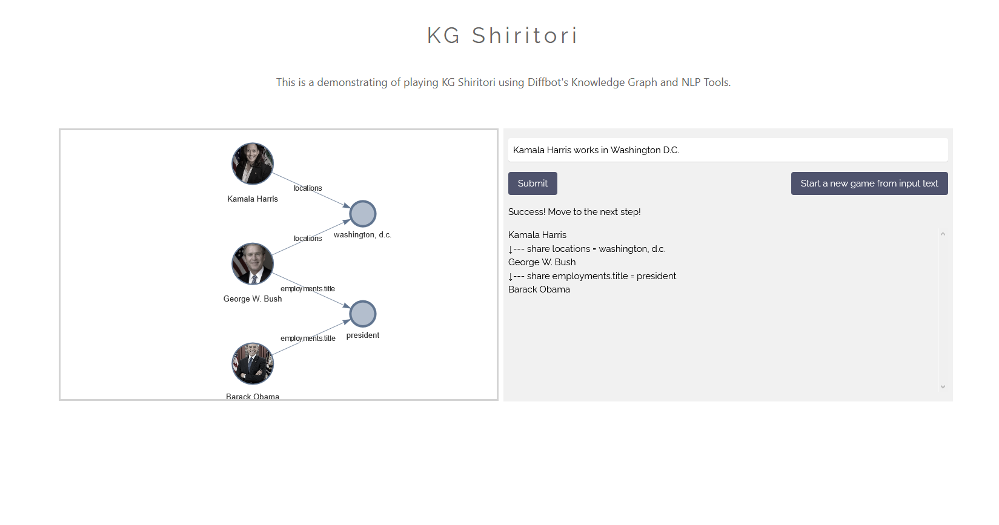

This is the source code used for my submission to [DBpedia Autumn Hackathon 2020](https://wiki.dbpedia.org/events/dbpedia-autumn-hackathon-2020). It will only work if you have an access token to Diffbot's API. It also is far from neat of maintainable, so take anything in this repo with a grain of salt...

## KG Shiritori App

KG Shiritori is a take on a classic Japanese word game, shiritori, using Diffbot's knowledge graph and natural language API. Regular shiritori is played by trying to make connections between words by taking the last letter of the previous word (e.g., dog->gate->egg->...). In KG Shiritori, the player tries to make connections between entities in diffbot's KG using properties that are common between them. The only rules are that you cannot repeat a specific property value and you cannot repeat an entity.

This application provides an interface for users to put in natural language descriptions which are passed to Diffbot's API, and the extracted facts are validated against Diffbot's KG. If valid facts are extracted, the system checks if any properties are shared between the previous entity and the new entry. The results of the entities that have been entered are displayed in a graphical form, using names and images extracted from Diffbot's KG.

A quick demo video of using this system can be seen [here](https://www.youtube.com/watch?v=BtSgWrNE7M8).
 
## To run

Install the requirements found in requirements.txt

Replace the TOKEN in app/flask/main.py with your access token to Diffbot's API

Run a flask server on app/flask/main.py
